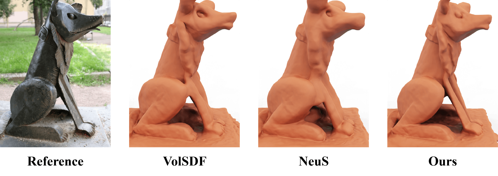

# Objects as volumes: A stochastic geometry view of opaque solids
## [Project website](https://imaging.cs.cmu.edu/volumetric_opaque_solids/)

<p align="center">
  
</p>

We explore the design space of attenuation coefficients for volumetric representations of opaque solids and demonstrate improvements from our theory in proof-of-concept surface reconstruction experiments. Primarily, we compare the parameters controlling the attenuation coefficient such as the implicit function distribution and the normal distribution. When applicable to the normal distirbution, we allow an anisotropy parameter to either be annealed on a fixed schedule or learned spatially. For the implementation of these distributions see the [attenuation coefficient model](./models/attenuation_coefficient.py).

## Configuration Options
The main parameters for our experiments are defined below. Across methods we mainly vary the implicit distribution and normal distribution. Refer to an [example configuration](./confs/gaussian_linearmixture_spatial_bg.conf) for full set of training options.

```conf
point_sampler {
  n_sdf_pts = 1024         # num evaluation points to find 0-level set intersection
  n_fg_samples = 21        # num samples prior to intersection interval
  n_surf_samples = 22      # num samples inside intersection interval
  n_bg_samples = 21        # num samples behind intersection interval
}

attenuation_coefficient {
  implicit_distribution = gaussian     # e.g. Laplace, loogistic, or Gaussian
  normal_distribution = linearmixture  # e.g. delta, uniform, or linear mixture
}
```
For normal distributions that take an anisotropy or mixture parameter, we provide additional control over whether the parameter is annealed or learned spatially.
```conf
train {
  anneal_end = 0          # anisotropy decays to 0 by anneal_end iters
}

# overrides annealed anisotropy
anisotropy_network {
  d_feature = 256         # dim of feature from SDF net
}
```
Finally, based on the dataset we use a different background. The DTU dataset uses a black background, the NeRF dataset uses a white background, and blended MVS learns a background color using [NeRF++](https://github.com/Kai-46/nerfplusplus).
```conf
# controls constant background color (black or white)
train {
  use_white_bkgd = False
}

# if outside samples > 0 overrides constant background color with learned background
point_sampler {
  n_outside = 32          # num samples used for background net
}

```
## Datasets
The following datasets can be readily ingested by our training pipeline. (See below for the data convention.)

* [DTU Dataset](https://volumetric-opaque-solids.s3.us-east-2.amazonaws.com/public_data/dtu.zip)

* [Blended MVS Dataset](https://volumetric-opaque-solids.s3.us-east-2.amazonaws.com/public_data/bmvs.zip)

* [NeRF Dataset](https://volumetric-opaque-solids.s3.us-east-2.amazonaws.com/public_data/nerf.zip)

#### Data Convention
The data is organized as follows:

```
<case_name>
|-- cameras_xxx.npz    # camera parameters
|-- image
    |-- 000.png        # target image for each view
    |-- 001.png
    ...
|-- mask
    |-- 000.png        # target mask each view (For unmasked setting, set all pixels as 255)
    |-- 001.png
    ...
```

Here the `cameras_xxx.npz` follows the data format in [IDR](https://github.com/lioryariv/idr/blob/main/DATA_CONVENTION.md), where `world_mat_xx` denotes the world to image projection matrix, and `scale_mat_xx` denotes the normalization matrix.

## Usage
### Setup
```shell
cd volumetric_opaque_solids
pip install -r requirements.txt
```
<details>
  <summary> Dependencies (click to expand) </summary>
  trimesh==3.9.8
  numpy==1.26.2
  pyhocon==0.3.57
  opencv_python==4.8.1.78
  tqdm==4.50.2
  torch==1.13.0
  scipy==1.11.3
  PyMCubes==0.1.2
  tensorboard
</details>

### Running

- **Training**

```shell
python exp_runner.py \
  --conf ./confs/<config name>.conf \
  --case <case_name> \
  --mode train
```

- **Extract surface from trained model** 

```shell
python exp_runner.py \
  --conf ./confs/<config name>.conf \
  --case <case_name> \
  --mode validate_mesh \
  --is_continue # use latest checkpoint
```

The corresponding mesh can be found in `exp/<case_name>/<exp_name>/meshes/<iter_steps>.ply`.

- **Render Image**

```shell
python exp_runner.py \
  --conf ./confs/<config name>.conf \
  --case <case_name> \
  --mode render \
  --image_idx 0 \ # image index
  --is_continue   # use latest checkpoint
```

## Acknowledgement
This codebase is simplified adaption of [NeuS](https://github.com/Totoro97/NeuS); the original codebase makes use of code snippets borrowed from [IDR](https://github.com/lioryariv/idr) and [NeRF-pytorch](https://github.com/yenchenlin/nerf-pytorch). Thanks for all of these great projects.
